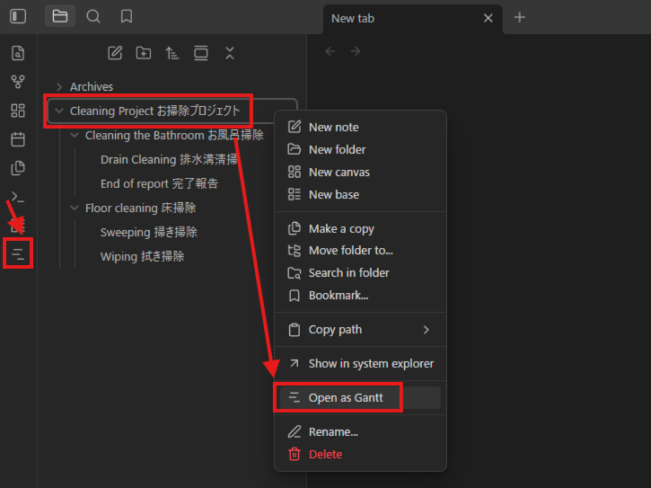
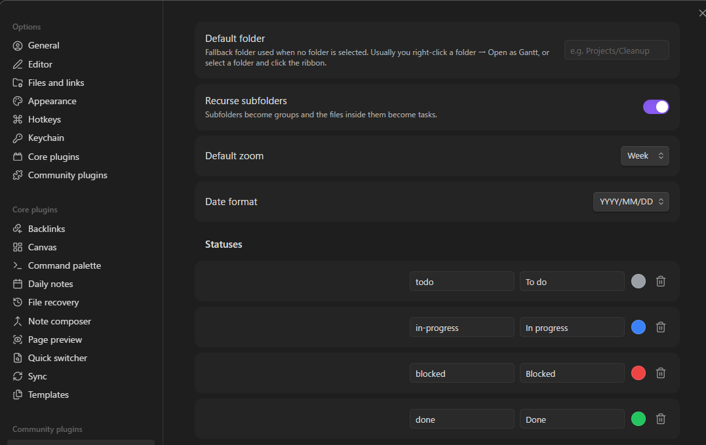
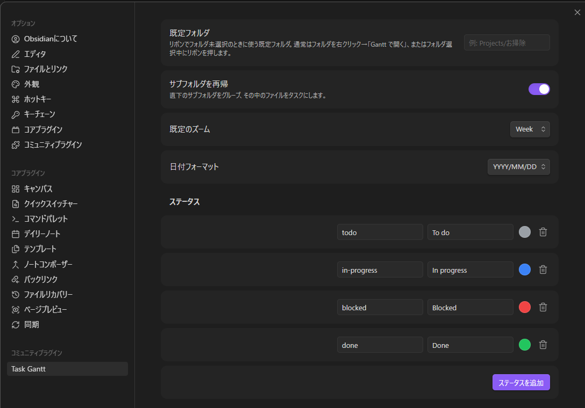

# Task Gantt

**English** | [日本語](#日本語)

An interactive project-management Gantt for Obsidian. **One Markdown file = one task**; a configured folder is shown and edited as a "table + timeline" Gantt.

## Screenshots

Open a folder as a Gantt from the left-column ribbon button, or by right-clicking the folder → **Open as Gantt**:



The folder opens as a table + timeline, with groups, bars, milestones, and dependency arrows:


Click a task to open the detail panel and edit its dates, status, assignee, and body:


## Usage

1. In **Settings → Gantt**, set the **target folder** (e.g. `Projects/Cleanup`).
2. Open the view from the **"Open Gantt" ribbon icon** in the left column (or the command **"Open Gantt"**). The ribbon button opens the Gantt for the folder of the currently open note — or the folder selected in the file explorer — and falls back to the default folder set in settings (the **vault root** when none is set). You can also right-click any folder → **Open as Gantt** to open that specific folder.
3. Direct subfolders become **groups**, and the `.md` files inside them become **tasks**.
4. **Drag a bar / resize its edges** to write the new dates back to that file's `start`/`end` frontmatter.
5. Click a task in the table — or **double-click its bar** in the timeline — to slide in a **detail panel** (dates, status, assignee, body) from the right.
6. Use the **Day / Week / Month / Fit** buttons to change the timeline scale. **Fit** auto-scales the chart to the pane width and re-fits when you resize.

The UI follows Obsidian's display language: Japanese when Obsidian is set to Japanese, English otherwise.

## Creating tasks

There's no separate "new task" form. Every note inside the target folder already appears as a row in the Gantt — **including notes that have no dates yet**. To schedule one, just click the note and set **Start** / **End** in the detail panel; a bar appears immediately and the dates are written back to that note's frontmatter. This makes it easy to turn existing notes into scheduled tasks in a couple of clicks.

## Task frontmatter

Each task is a single Markdown file. The schedule lives in frontmatter; the description is the body.

```markdown
---
start: 2026-02-04
end: 2026-02-07
status: in-progress
assignee: kato
after:
  - "[[Sweeping]]"     # predecessor (dependency arrow)
---

# Wiping
The body is the task description (shown in the detail panel).
```

| Frontmatter | Meaning |
|-------------|---------|
| `start` / `end` | Start / end date `YYYY-MM-DD` (bar position and length). |
| `status` | Status ID (defined in settings, reflected in bar color). |
| `assignee` | Assignee (label shown next to the bar). |
| `after` | Array of wikilinks to predecessors (dependency arrows; violations turn red). |
| `progress` | Progress 0–100 (fill inside the bar). |
| `milestone` | `true` for a diamond (zero duration). |

**Milestones:** a task that has only an `end` date (no `start`) is automatically treated as a milestone and drawn as a diamond. Setting `milestone: true` does the same. To turn a milestone back into a ranged task, just give it a `start` date (e.g. in the detail panel).

The task name is the file name (without extension); the group is the parent subfolder name. Frontmatter key names can be changed in settings.

Sample data for a quick try lives in `examples/Cleaning Project お掃除プロジェクト/` (point the target folder at it).

## Dependencies

Drag from a bar's round handle to another bar to create a dependency. The connected ends decide the type: **FS** (finish→start), **SS** (start→start), **FF** (finish→finish). Click a dependency line to remove it (undo with **Ctrl+Z**, or the undo button).

## Settings

Open **Settings → Task Gantt** to configure the plugin (default folder, subfolder recursion, default zoom, and the **date display format** — `YYYY/MM/DD`, `DD/MM/YYYY`, or `MM/DD/YYYY`; stored dates always stay ISO `YYYY-MM-DD`).

**Statuses are fully customizable** — add, edit, or delete them. Each status has an **id** (matches the `status` frontmatter value), a **label**, and a **color** that is reflected in the bar color. Click **Add status** to create one, or the trash icon to remove it.

You can also rename the **frontmatter keys** the plugin reads (start, end, status, assignee, after, progress, milestone) to match your own vault conventions.



## Development

```bash
npm install      # install deps
npm run dev      # watch build
npm run build    # type-check + production build
```

Copy `main.js` / `manifest.json` / `styles.css` into `<vault>/.obsidian/plugins/task-gantt/` to enable it.

## Design

See [`docs/adr/`](./docs/adr/) for the rationale behind design decisions (latest direction: ADR-0004) and [`CONTEXT.md`](./CONTEXT.md) for terminology.

## Limitations

Auto-scheduling (critical path), sub-day time granularity, cross-folder aggregation, board/table views, and a task-creation UI are not yet implemented.

## License

MIT — see [`LICENSE`](./LICENSE).

---

# 日本語

[English](#task-gantt) | **日本語**

プロジェクト管理ツールのようなタスク管理 UI を Obsidian で実現するプラグインです。**1 ファイル = 1 タスク**とし、指定フォルダ配下を **「表＋タイムライン」ガント**で表示・編集します。

## スクリーンショット

左列のリボンボタン、またはフォルダの右クリック →**「Open as Gantt」**から Gantt として開きます：


「表＋タイムライン」で開き、グループ・バー・マイルストーン・依存の矢印が表示されます：


タスクをクリックすると詳細パネルが開き、日付・状態・担当・本文を編集できます：


## 使い方

1. 設定 → Gantt で **対象フォルダ**を指定（例: `Projects/お掃除`）。
2. 左列の **「Gantt を開く」リボンアイコン**（またはコマンド「Gantt を開く」）でビューを開く。リボンボタンは、**現在開いているノートのフォルダ**（またはエクスプローラで選択中のフォルダ）を Gantt 表示し、どちらも無ければ設定の既定フォルダ（未設定なら **Vault ルート**）を開きます。特定のフォルダを開きたいときは、フォルダを右クリック →**「Open as Gantt」**でも開けます。
3. 直下のサブフォルダが**グループ**、その中の `.md` が**タスク**になります。
4. バーを**ドラッグ／端をリサイズ**すると、そのファイルのフロントマター `start`/`end` に書き戻します。
5. 表のタスクをクリック、または**タイムラインのバーをダブルクリック**すると、右から**詳細パネル**（日付・ステータス・担当者・本文）がスライドインします。
6. **Day / Week / Month / Fit** ボタンで時間軸の拡大率を変更できます。**Fit** はチャートをペイン幅に自動で収め、リサイズにも追従します。

UI 表示は Obsidian の表示言語に追従します（日本語なら日本語、それ以外は英語）。

## タスクの作成

専用の「新規タスク」フォームはありません。対象フォルダ内のノートは、**まだ日付が無いものも含めて**そのままガントの行として表示されます。スケジュールを付けたいノートをクリックし、詳細パネルで **開始 / 終了** を入力するだけでバーが現れ、日付はそのノートのフロントマターに書き戻されます。これにより、既存ノートを数クリックでスケジュール付きタスクに変えられます。

## タスクの書き方

各タスクは 1 つの Markdown ファイル。スケジュールはフロントマター、説明は本文に書きます。

```markdown
---
start: 2026-02-04
end: 2026-02-07
status: in-progress
assignee: kato
after:
  - "[[掃き掃除]]"     # 先行タスク（依存＝矢印）
---

# 拭き掃除
本文がタスクの説明（詳細パネルに表示）。
```

| フロントマター | 意味 |
|----------------|------|
| `start` / `end` | 開始 / 終了日 `YYYY-MM-DD`（バーの位置と長さ） |
| `status` | ステータス ID（設定で定義、バー色に反映） |
| `assignee` | 担当者（バー脇にラベル表示） |
| `after` | 先行タスクへの wikilink 配列（依存＝矢印、違反は赤） |
| `progress` | 進捗 0–100（バー内の塗り） |
| `milestone` | `true` で菱形（期間ゼロ） |

**マイルストーン：** `end`（終了日）だけがあり `start`（開始日）が無いタスクは、自動的にマイルストーンと判定され菱形で描画されます。`milestone: true` を指定しても同じです。マイルストーンを通常タスクに戻すには、`start`（開始日）を与えてください（詳細パネルからでも可）。

タスク名はファイル名（拡張子なし）。グループは直上のサブフォルダ名。フロントマターのキー名は設定で変更できます。

`examples/Cleaning Project お掃除プロジェクト/` に動作確認用のサンプルがあります（対象フォルダにそれを指定）。

## 依存関係

バーの丸ハンドルから別のバーへドラッグすると依存を作成します。つないだ端で種類が決まります：**FS**（終了→開始）・**SS**（開始→開始）・**FF**（終了→終了）。依存線をクリックで切断（**Ctrl+Z** または取り消しボタンで戻せます）。

## 設定

**設定 → Task Gantt** からプラグインを設定できます（既定フォルダ・サブフォルダの再帰・既定ズーム・**日付の表示フォーマット** ＝ `YYYY/MM/DD`／`DD/MM/YYYY`／`MM/DD/YYYY`。保存値は常に ISO `YYYY-MM-DD`）。

**ステータスは自由に追加・編集・削除**できます。各ステータスは **id**（フロントマターの `status` 値と対応）・**ラベル**・**色**（バー色に反映）を持ちます。「**ステータスを追加**」で新規作成、ゴミ箱アイコンで削除します。

プラグインが読む**フロントマターのキー名**（start / end / status / assignee / after / progress / milestone）も、各自の Vault の慣習に合わせて変更できます。



## 開発

```bash
npm install      # 依存をインストール
npm run dev      # 監視ビルド
npm run build    # 型チェック＋本番ビルド
```

`main.js` / `manifest.json` / `styles.css` を `<vault>/.obsidian/plugins/task-gantt/` にコピーして有効化。

## 設計

設計判断の経緯は [`docs/adr/`](./docs/adr/)（最新方針は ADR-0004）、用語は [`CONTEXT.md`](./CONTEXT.md) を参照。

## 既知の制限

自動スケジューリング（クリティカルパス）・時刻粒度・複数フォルダ横断・ボード/テーブルビュー・タスク新規作成 UI は未実装。

## ライセンス

MIT ライセンス（[`LICENSE`](./LICENSE) を参照）。
