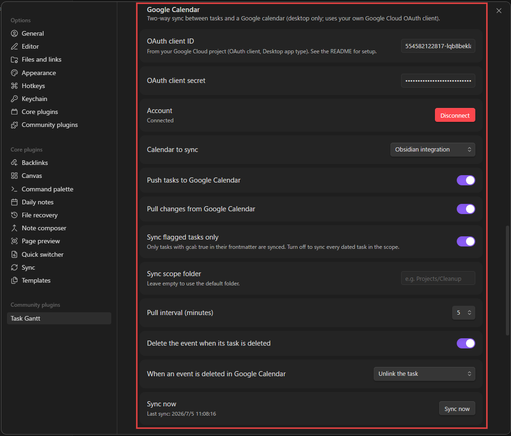
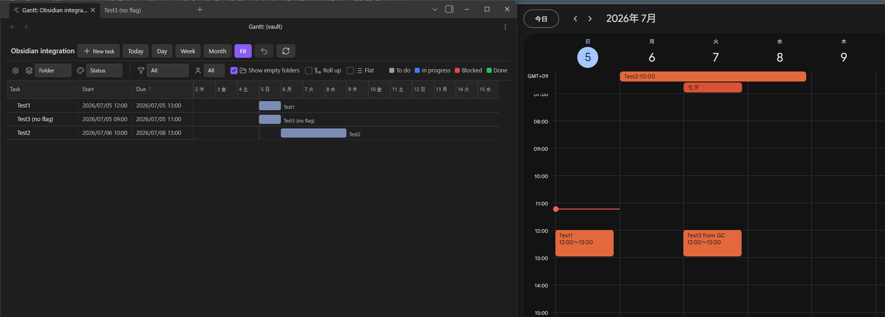
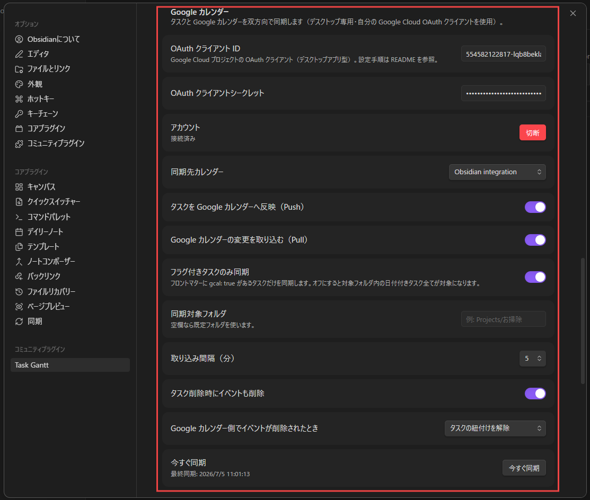

# Task Gantt

**English** | [日本語](#日本語)

An interactive project-management Gantt for Obsidian. **One Markdown file = one task**; a configured folder is shown and edited as a "table + timeline" Gantt — drag bars to reschedule, link dependencies, set milestones, sort and filter, and move tasks between folders by dragging.

> Requires **Obsidian 1.13.0 or later**.

## Screenshots

Open a folder as a Gantt from the left-column ribbon button, or by right-clicking the folder → **Open as Gantt**:


The folder opens as a table + timeline, with groups, bars, milestones, and dependency arrows:


Click a task to open the detail panel and edit its dates, status, assignee, progress, and body:


## Usage

1. In **Settings → Task Gantt**, set the **target folder** (e.g. `Projects/Cleanup`).
2. Open the view from the **"Open Gantt" ribbon icon** in the left column (or the command **"Open Gantt"**). The ribbon opens the Gantt for the folder of the currently open note — or the folder selected in the file explorer — and falls back to the default folder in settings (the **vault root** when none is set). You can also right-click any folder → **Open as Gantt**.
3. Direct subfolders become **groups**, and the `.md` files inside them become **tasks**.
4. **Drag a bar / resize its edges** to write the new dates back to that file's `start`/`end` frontmatter. You can also **double-click a Start/Due cell** in the table to pick a date from a calendar.
5. Click a task in the table — or **double-click its bar** — to slide in a **detail panel** (dates, status, assignee, progress, body) from the right.
6. Use the **＋ New task** button to create a one-day task in the current folder and name it on the spot, and **Today** to scroll the timeline to the current date.
7. Use the **Day / Week / Month / Fit** buttons to change the timeline scale. **Fit** auto-scales to the pane width and re-fits when you resize.

The UI follows Obsidian's display language. Supported: English, Japanese, Korean, Chinese (Simplified & Traditional), French, Spanish, and Russian; any other language falls back to English.

## View options

An options row above the table shapes how the board is displayed.

**Group by** folder, status, or assignee, and **color by** status or assignee (with a legend). Filters narrow the board to a single status or assignee:


**Sort** by clicking a column header; click it again to flip ascending/descending (↑/↓):


**Choose columns** with the gear button — show or hide Start, Due, Assignee, and Status. The column layout and sort are remembered across sessions:


**Flat view** lists every task in one sorted list, ignoring folders and nesting:


## Moving tasks between folders

When grouped by folder, **drag a task row** onto a folder to move the task into it (or onto another task to drop it into that task's folder). Links are updated automatically, and the move is **undoable** with **Ctrl/Cmd+Z** or the undo button. Empty folders stay visible as rows so you always have a drop target; the **Show empty folders** toggle (on by default) controls this.

## Subtasks

Give a task a `parent` (a single wikilink to another task) and it nests under that parent in the table, with a chevron to collapse or expand. When grouped by folder, **drag a task onto another task** to make it a subtask — it moves into the parent's folder with its whole subtree; **drag it onto a folder** to detach it back to the top level. Cycles are blocked, and every move is undoable. The **Roll up** toggle draws a parent's bar (and its Start/Due cells) as the span of its descendants. Set or clear the parent from the detail panel.

## Tags

Tasks use Obsidian's native `tags` (frontmatter `tags:` plus inline `#tag`), so they stay in sync with Obsidian's search and tag pane. **Group by Tag** to see a task under each of its tags — a multi-valued task appears in several groups — filter by tag, and show a **Tags** column of chips. When grouped by tag, **drag a task onto a tag group** to add that tag, distinct from a folder drop, which *moves* the task. Add or remove tags in the detail panel.

## Coloring tags and folders

Tags and folders get an automatic color from their name, and you can override it. **Right-click a folder heading, a tag heading, or a tag chip** to change or reset its color. Tag colors can also be set in **Settings → Task Gantt → Tag colors** (folder colors are right-click only).

<video src="https://github.com/katoiek/task-gantt/raw/main/docs/images/coloring_folder_tag.mp4" controls width="100%"></video>

> If the video doesn't play above, [watch it here](docs/images/coloring_folder_tag.mp4).

## Creating tasks

Press **＋ New task** to create a dated note in the current folder and rename it immediately. You don't have to start there, though: every note inside the target folder already appears as a row — **including notes with no dates yet** — so you can also click an existing note and set **Start** / **Due** in the detail panel to turn it into a scheduled task.

## Task frontmatter

Each task is a single Markdown file. The schedule lives in frontmatter; the description is the body.

```markdown
---
start: 2026-02-04
end: 2026-02-07
status: in-progress
assignee: kato
progress: 40
after:
  - "[[Sweeping]]"     # predecessor (dependency arrow)
---

# Wiping
The body is the task description (shown in the detail panel).
```

| Frontmatter | Meaning |
|-------------|---------|
| `start` / `end` | Start / end date `YYYY-MM-DD` (bar position and length). A time of day can be added as `YYYY-MM-DDTHH:mm+09:00` (edit via the detail panel; the offset follows the **Timezone** setting). |
| `status` | Status ID (defined in settings, reflected in bar color). |
| `assignee` | Assignee (label shown next to the bar). |
| `progress` | Progress 0–100 (fill inside the bar; editable with the detail-panel slider). |
| `after` | Array of wikilinks to predecessors (dependency arrows; violations turn red). |
| `milestone` | `true` for a diamond (zero duration). |
| `gcal` | `true` opts the task into [Google Calendar sync](#google-calendar-sync-optional-desktop-only) (only used when **Sync flagged tasks only** is on). |
| `gcalId` | Set automatically once the task is pushed to Google Calendar — the linked event's ID. Don't edit by hand. |

**Milestones:** a task that has only an `end` date (no `start`) is automatically treated as a milestone and drawn as a diamond. Setting `milestone: true` does the same. To turn a milestone back into a ranged task, give it a `start` date.

The task name is the file name (without extension); the group is the parent subfolder name. Frontmatter key names can be changed in settings.

Sample data for a quick try lives in `examples/Cleaning Project お掃除プロジェクト/` (point the target folder at it).

## Dependencies

Drag from a bar's round handle to another bar to create a dependency. The connected ends decide the type: **FS** (finish→start), **SS** (start→start), **FF** (finish→finish). SS/FF successors snap to their predecessor when you reschedule. Click a dependency line to remove it (undo with **Ctrl/Cmd+Z** or the undo button).

## Settings

Open **Settings → Task Gantt** to configure the default folder, subfolder recursion, default zoom, and the **date display format** (`YYYY/MM/DD`, `DD/MM/YYYY`, or `MM/DD/YYYY`; stored dates always stay ISO `YYYY-MM-DD`).

The **Timezone** setting (system or a fixed GMT offset, listed with representative cities) controls how times of day are displayed and saved. Changing it re-displays stored times in the new offset.


**Statuses are fully customizable** — add, edit, or delete them. Each status has an **id** (matches the `status` frontmatter value), a **label**, and a **color** reflected in the bar.

You can also rename the **frontmatter keys** the plugin reads (start, end, status, assignee, after, progress, milestone) to match your own vault conventions.


## Notifications (optional)

Task Gantt can post reminders for tasks that have a **time of day** to **Discord** and/or **Slack** via incoming webhooks. In **Settings → Task Gantt → Notifications**, set the webhook URLs, choose the targets (start / due), and pick the lead times (1 week / 1 day / 1 hour / 10 minutes before, or at the exact time). Use **Send a test message** to verify the webhook instantly.


- **Network use**: when enabled, the plugin sends HTTP POST requests containing only the task name and its date/time to the webhook URLs you configured — nothing else is sent, and nowhere else. Leaving both URLs empty (the default) disables all network access.
- Notifications fire only while Obsidian is running. Triggers that passed while Obsidian was closed are skipped, and each trigger is sent at most once.
- Date-only tasks (without a time of day) are never notified.
- The whole vault is scanned — no folder configuration needed; any task with a time of day qualifies.

## Google Calendar sync (optional, desktop only)

Task Gantt can keep tasks and a Google calendar in **two-way sync**: task changes (create / reschedule / delete) are pushed as events, and moving or deleting those events in Google Calendar flows back into the task's frontmatter. Each direction can be toggled independently in **Settings → Task Gantt → Google Calendar**.

### Setup

The plugin has no server, so it uses **your own Google Cloud project**:

1. In [Google Cloud Console](https://console.cloud.google.com/), create a project and enable the **Google Calendar API**.
2. Configure the OAuth consent screen (External is fine) and add your own Google account as a **test user**. Because the app is yours and unverified, Google shows an "unverified app" warning during consent — expected, just continue.
3. Create an **OAuth client ID** of type **Desktop app**, and paste the client ID and secret into the plugin settings.
4. Press **Connect** — your browser opens Google's consent screen, and the plugin receives the authorization on `127.0.0.1` (loopback). Then pick the **calendar to sync** (a dedicated calendar is recommended).



### How it syncs

- **Pull only ever touches events that Task Gantt itself created.** Creating an event directly in Google Calendar does **not** create a task, and editing or deleting a foreign (non-plugin) event is ignored — the plugin only reads back changes to events it pushed. Anything already on your calendar is left untouched.
- By default only tasks with the **`gcal: true`** flag in their frontmatter sync (**opt-in**; toggle it per task in the detail panel — which also shows an **Open in Google Calendar** link once synced). Turn off **Sync flagged tasks only** to sync every dated task in the scope folder instead.
- Date-only tasks become **all-day events**; tasks with a time of day on both ends become timed events (using the plugin's **Timezone** setting); milestones become one-day events. The linked event's ID is stored in the task's `gcalId` frontmatter key (set automatically — don't edit it by hand).
- Local edits push within seconds; remote changes are pulled at the configured interval (default 5 minutes). Titles sync one way only (task → event): renaming the event in Google Calendar is reverted on the next push, since renaming files from outside is risky.
- If both sides changed since the last sync, the **newer edit wins** and a notice tells you which side was kept.
- Deleting a task deletes its event (configurable). Deleting the event in Google Calendar just **unlinks** the task by default (optionally also clearing its dates) — files are never deleted.
- Recurring events are not supported (skipped by both directions).

**Example** — `Test1` and `Test2` carry `gcal: true` and pushed through as events; `Test3 (no flag)` stayed local only. The `Test3 from GC` event and the `七夕` holiday were created directly in Google Calendar and never became tasks:



### Disclosure

- **Network use**: when connected, the plugin talks to Google's OAuth and Calendar APIs only, sending the synced tasks' name, dates, and a body excerpt (first 500 characters) with a link back to the note. Leaving the feature unconfigured (the default) makes no network requests.
- **Account & credentials**: requires a Google account and your own Google Cloud OAuth client. The plugin requests only the `calendar.events` and `calendar.calendarlist.readonly` scopes. The OAuth **refresh token, client ID, and secret are stored in plain text** in the plugin's `data.json` inside your vault — treat that file accordingly (be careful when the vault itself is synced or shared).
- Mobile is not supported (the OAuth loopback needs a desktop); other features work on mobile as usual.

## Development

```bash
npm install      # install deps
npm run dev      # watch build
npm run build    # type-check + production build
npm test         # headless model tests
```

Copy `main.js` / `manifest.json` / `styles.css` into `<vault>/.obsidian/plugins/task-gantt/` to enable it.

## Design

See [`docs/adr/`](./docs/adr/) for the rationale behind design decisions (latest: ADR-0005) and [`CONTEXT.md`](./CONTEXT.md) for terminology.

## Limitations

Auto-scheduling (critical path), sub-day time granularity, and cross-folder aggregation are not implemented. Custom-field columns are planned.

## License

MIT — see [`LICENSE`](./LICENSE).

---

# 日本語

[English](#task-gantt) | **日本語**

プロジェクト管理ツールのようなタスク管理 UI を Obsidian で実現するプラグインです。**1 ファイル = 1 タスク**とし、指定フォルダ配下を **「表＋タイムライン」ガント**で表示・編集します。バーのドラッグで日程変更、依存の作成、マイルストーン、ソート・フィルタ、ドラッグでのフォルダ移動などができます。

> **Obsidian 1.13.0 以降**が必要です。

## スクリーンショット

左列のリボンボタン、またはフォルダの右クリック →**「Open as Gantt」**から Gantt として開きます：


「表＋タイムライン」で開き、グループ・バー・マイルストーン・依存の矢印が表示されます：


タスクをクリックすると詳細パネルが開き、日付・状態・担当・進捗・本文を編集できます：


## 使い方

1. **設定 → Task Gantt** で**対象フォルダ**を指定（例: `Projects/お掃除`）。
2. 左列の **「Gantt を開く」リボンアイコン**（またはコマンド「Gantt を開く」）でビューを開く。リボンは、**現在開いているノートのフォルダ**（またはエクスプローラで選択中のフォルダ）を Gantt 表示し、どちらも無ければ設定の既定フォルダ（未設定なら **Vault ルート**）を開きます。フォルダを右クリック →**「Open as Gantt」**でも開けます。
3. 直下のサブフォルダが**グループ**、その中の `.md` が**タスク**になります。
4. バーを**ドラッグ／端をリサイズ**すると、そのファイルの `start`/`end` に書き戻します。表の**開始・期限セルをダブルクリック**すると、カレンダーから日付を選べます。
5. 表のタスクをクリック、または**バーをダブルクリック**すると、右から**詳細パネル**（日付・ステータス・担当者・進捗・本文）がスライドインします。
6. **＋ 新規タスク**ボタンで現在のフォルダに1日タスクを作ってその場で命名、**今日**ボタンでタイムラインを今日へスクロールできます。
7. **Day / Week / Month / Fit** ボタンで時間軸の拡大率を変更。**Fit** はペイン幅に自動で収め、リサイズにも追従します。

UI 表示は Obsidian の表示言語に追従します。対応言語：英語・日本語・韓国語・中国語（簡体／繁体）・フランス語・スペイン語・ロシア語（その他は英語にフォールバック）。

## 表示オプション

表の上のオプション行で、ボードの見せ方を調整できます。

**グループ化**（フォルダ／ステータス／担当者）と**色分け**（ステータス／担当者・凡例付き）。フィルタで特定のステータス・担当者に絞り込めます：


**ソート**は列ヘッダをクリック。もう一度クリックで昇順／降順を切替（↑/↓）：


**列の表示**は歯車ボタンから、開始・期限・担当者・ステータスを出し分け。列レイアウトとソートはセッションをまたいで保存されます：


**フラット表示**は、フォルダや入れ子を無視して全タスクを1本のソート済みリストで表示します：


## フォルダ間のタスク移動

フォルダでグループ化しているとき、**タスク行をドラッグ**してフォルダにドロップするとそのフォルダへ移動できます（別タスクへドロップすると、そのタスクと同じフォルダへ）。リンクは自動更新され、移動は **Ctrl/Cmd+Z** または取り消しボタンで**元に戻せます**。空のフォルダも行として表示されるので常にドロップ先になります（**空フォルダを表示**トグル＝既定ON で切替）。

## サブタスク

タスクに `parent`（別タスクへの単一 wikilink）を与えると、表でその親の下に入れ子表示され、シェブロンで折りたたみできます。フォルダでグループ化中は、**タスクを別タスクへドラッグ**するとサブタスク化（親のフォルダへサブツリーごと移動）、**フォルダへドラッグ**すると親を解除してトップレベルへ戻します。循環は禁止され、移動はすべて取り消し可能です。**ロールアップ**トグルで、親のバー（と開始・期限セル）を子孫全体の範囲として描けます。親の設定・解除は詳細パネルからも行えます。

## タグ

タスクは Obsidian ネイティブの `tags`（フロントマター `tags:` ＋本文 `#tag`）を使うので、Obsidian の検索・タグペインと同期します。**タグでグループ化**すると、各タグの下にそのタスクが表示され（多値のタスクは複数グループに登場）、タグでの絞り込みや、チップ表示の**タグ列**も使えます。タグでグループ化中は、**タスクをタグのグループへドラッグ**するとそのタグを付与できます（フォルダへのドロップ＝移動とは別動作）。タグの追加・削除は詳細パネルからも行えます。

## タグ・フォルダの色

タグとフォルダは名前から自動で色が付き、上書きもできます。**フォルダの見出し・タグの見出し・タグのチップを右クリック**して、色の変更／リセットができます。タグの色は **設定 → Task Gantt → タグの色** からも指定できます（フォルダの色は右クリックのみ）。

<video src="https://github.com/katoiek/task-gantt/raw/main/docs/images/coloring_folder_tag.mp4" controls width="100%"></video>

> 上で動画が再生されない場合は [こちら](docs/images/coloring_folder_tag.mp4) からご覧ください。

## タスクの作成

**＋ 新規タスク**で現在のフォルダに日付付きノートを作り、すぐ名前を付けられます。もちろんそこから始める必要はありません。対象フォルダ内のノートは、**まだ日付が無いものも含めて**そのまま行として表示されるので、既存ノートをクリックして詳細パネルで **開始 / 期限** を入力すれば、そのままスケジュール付きタスクになります。

## タスクの書き方

各タスクは 1 つの Markdown ファイル。スケジュールはフロントマター、説明は本文に書きます。

```markdown
---
start: 2026-02-04
end: 2026-02-07
status: in-progress
assignee: kato
progress: 40
after:
  - "[[掃き掃除]]"     # 先行タスク（依存＝矢印）
---

# 拭き掃除
本文がタスクの説明（詳細パネルに表示）。
```

| フロントマター | 意味 |
|----------------|------|
| `start` / `end` | 開始 / 終了日 `YYYY-MM-DD`（バーの位置と長さ）。`YYYY-MM-DDTHH:mm+09:00` 形式で時刻も設定可（詳細パネルで編集。オフセットは**タイムゾーン**設定に従う） |
| `status` | ステータス ID（設定で定義、バー色に反映） |
| `assignee` | 担当者（バー脇にラベル表示） |
| `progress` | 進捗 0–100（バー内の塗り。詳細パネルのスライダーで編集） |
| `after` | 先行タスクへの wikilink 配列（依存＝矢印、違反は赤） |
| `milestone` | `true` で菱形（期間ゼロ） |
| `gcal` | `true` で **Google カレンダー同期**（後述）の対象にする（**フラグ付きタスクのみ同期**がオンのときだけ判定に使用） |
| `gcalId` | タスクを Google カレンダーへ Push すると自動で入る、紐付け先イベントの ID。手動編集不可 |

**マイルストーン：** `end`（終了日）だけがあり `start`（開始日）が無いタスクは、自動的にマイルストーンと判定され菱形で描画されます。`milestone: true` でも同じです。通常タスクに戻すには `start`（開始日）を与えてください。

タスク名はファイル名（拡張子なし）。グループは直上のサブフォルダ名。フロントマターのキー名は設定で変更できます。

`examples/Cleaning Project お掃除プロジェクト/` に動作確認用のサンプルがあります（対象フォルダにそれを指定）。

## 依存関係

バーの丸ハンドルから別のバーへドラッグすると依存を作成します。つないだ端で種類が決まります：**FS**（終了→開始）・**SS**（開始→開始）・**FF**（終了→終了）。SS/FF の後続は、先行の日程変更に追従します。依存線をクリックで切断（**Ctrl/Cmd+Z** または取り消しボタンで戻せます）。

## 設定

**設定 → Task Gantt** から、既定フォルダ・サブフォルダの再帰・既定ズーム・**日付の表示フォーマット**（`YYYY/MM/DD`／`DD/MM/YYYY`／`MM/DD/YYYY`。保存値は常に ISO `YYYY-MM-DD`）を設定できます。

**タイムゾーン**設定（システム / 固定GMTオフセット・代表都市付き一覧）で時刻の表示・保存に使うタイムゾーンを選べます。変更すると保存済みの時刻が新しいオフセットに換算されて表示されます。


**ステータスは自由に追加・編集・削除**できます。各ステータスは **id**（フロントマターの `status` 値と対応）・**ラベル**・**色**（バー色に反映）を持ちます。

プラグインが読む**フロントマターのキー名**（start / end / status / assignee / after / progress / milestone）も、各自の Vault の慣習に合わせて変更できます。


## 通知（任意）

**時刻を設定した**タスクの開始・期限を、Incoming Webhook 経由で **Discord** / **Slack** に通知できます。**設定 → Task Gantt → 通知** で Webhook URL・対象（開始/期限）・通知タイミング（1週間前・1日前・1時間前・10分前・時刻ちょうど）を設定してください。**テスト送信**ボタンで Webhook の疎通をすぐ確認できます。


- **ネットワーク利用について**：有効にすると、設定した Webhook URL に対してタスク名と日時のみを HTTP POST で送信します。それ以外の情報は送らず、他の宛先にも送信しません。URL を両方空欄（既定）にすればネットワークアクセスは一切行いません。
- 通知は Obsidian の起動中のみ動作します。終了中に過ぎたタイミングはスキップされ、同じ通知は二度送られません。
- 日付のみ（時刻なし）のタスクは通知対象外です。
- 対象は Vault 全体です。フォルダの設定は不要で、時刻を設定したタスクはすべて対象になります。

## Google カレンダー同期（任意・デスクトップ専用）

タスクと Google カレンダーを**双方向で同期**できます。タスクの作成・日程変更・削除はイベントとして反映され、Google カレンダー側でのイベント移動・削除はタスクのフロントマターへ書き戻されます。**設定 → Task Gantt → Google カレンダー** で方向ごと（Push / Pull）に ON/OFF できます。

### セットアップ

プラグインにはサーバーがないため、**ユーザー自身の Google Cloud プロジェクト**を使います。

1. [Google Cloud Console](https://console.cloud.google.com/) でプロジェクトを作成し、**Google Calendar API** を有効化する。
2. OAuth 同意画面を設定（External で可）し、自分の Google アカウントを**テストユーザー**に追加する。アプリは自分専用の未確認アプリなので、同意時に「確認されていないアプリ」の警告が出ますが想定どおりです（そのまま続行してください）。
3. **OAuth クライアント ID**（種類：**デスクトップアプリ**）を作成し、クライアント ID とシークレットをプラグイン設定に貼り付ける。
4. **接続**を押すとブラウザで Google の同意画面が開き、`127.0.0.1`（ループバック）で認可を受け取ります。その後**同期先カレンダー**を選択してください（専用カレンダーの利用を推奨）。



### 同期の仕組み

- **Pull（Google カレンダー→タスク）が対象にするのは、Task Gantt 自身が作成したイベントのみです。** Google カレンダー側で直接イベントを新規作成しても、それがタスクとして取り込まれることは**ありません**。また、プラグインが関与していない既存イベントの編集・削除も無視されます — Pull は自分がPushしたイベントへの変更を読み戻すだけで、カレンダーに元からある予定には一切手を付けません。
- 既定ではフロントマターに **`gcal: true`** フラグを付けたタスクだけが同期されます（**オプトイン**。詳細パネルのトグルで切替でき、同期済みタスクには **Google カレンダーで開く** リンクも表示されます）。**フラグ付きタスクのみ同期**をオフにすると、対象フォルダ内の日付付きタスク全てが対象になります。
- 日付のみのタスクは**終日イベント**、両端に時刻のあるタスクは時刻付きイベント（プラグインの**タイムゾーン**設定を使用）、マイルストーンは1日のイベントになります。紐付け先イベントの ID はタスクの `gcalId` キーに自動で保存されます（手動編集は不可）。
- ローカルの編集は数秒で Push され、Google カレンダー側の変更は設定間隔（既定5分）で Pull されます。タイトルの同期はタスク→イベントの一方向のみで、イベント名を Google カレンダー側で変更しても次の Push でタスク名に戻ります（外部からのファイルリネームは危険なため）。
- 前回同期以降に両側が変更されていた場合は**新しい方の編集が勝ち**、どちらを採用したかを通知します。
- タスクを削除するとイベントも削除されます（設定で変更可）。Google カレンダー側でイベントを削除した場合、既定ではタスクの**紐付けを解除するだけ**です（日付もクリアする設定あり）。ファイルが削除されることはありません。
- 繰り返しイベントは Push / Pull とも対象外です。

**例**：`Test1` と `Test2` は `gcal: true` を付けて Push され、イベントとして反映されています。`Test3 (no flag)` はフラグが無いためローカルのみに留まっています。一方 `Test3 from GC` と祝日「七夕」は Google カレンダー側で直接作られたもので、タスクとしては取り込まれていません：


### 開示事項

- **ネットワーク利用について**：接続すると Google の OAuth / Calendar API とのみ通信し、同期対象タスクの名前・日付・本文抜粋（先頭500文字）とノートへ戻るリンクを送信します。未設定（既定）の場合、ネットワークアクセスは一切行いません。
- **アカウントと認証情報**：Google アカウントと自身の Google Cloud OAuth クライアントが必要です。要求スコープは `calendar.events` と `calendar.calendarlist.readonly` のみです。OAuth の**リフレッシュトークン・クライアント ID・シークレットは Vault 内の `data.json` に平文保存**されます。Vault 自体を同期・共有している場合はご注意ください。
- モバイルは非対応です（OAuth のループバック受信にデスクトップが必要）。他の機能は従来どおりモバイルでも動作します。

## 開発

```bash
npm install      # 依存をインストール
npm run dev      # 監視ビルド
npm run build    # 型チェック＋本番ビルド
npm test         # ヘッドレスのモデルテスト
```

`main.js` / `manifest.json` / `styles.css` を `<vault>/.obsidian/plugins/task-gantt/` にコピーして有効化。

## 設計

設計判断の経緯は [`docs/adr/`](./docs/adr/)（最新は ADR-0005）、用語は [`CONTEXT.md`](./CONTEXT.md) を参照。

## 既知の制限

自動スケジューリング（クリティカルパス）・時刻粒度・複数フォルダ横断は未実装。カスタムフィールド列は予定。

## ライセンス

MIT ライセンス（[`LICENSE`](./LICENSE) を参照）。
